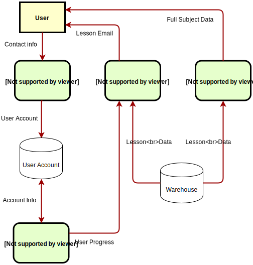

# <a href="https://immense-ridge-78589.herokuapp.com/">Email Lesson Manager</a>  

## Table of Contents 

- [Overview](#overview)
- [Instructions](#instructions)
- [Technologies](#technologies)
- [Future Development](#future)
- [Developers](#team)

---

## Overview 

This is a full stack web application that provides daily lessons via email to subscribed users.

It utilizes scheduled mailing in tandem with static resources to solve the challenge of pacing in self-education.

---

## Instructions 

1. Sign up will send an welcome email and set you up for daily JavaScript lessons.

## 
 

2. Server sends scheduled, daily emails containing lessons.

**[ Daily Lesson ]**

## 
 

If you have completed all available materials, an alternative reading material will be suggested until new courses become available.

**[ Completion Message ]**

## 
 

3. User can choose to follow the emailed link to the website, which provides further detail about the subject.

4. User can explore at will related subjects such as HTML, CSS, HTTP status codes and more.

5. Get smarter every day!

<a href='#top'>[Back to Top]</a>

---

## Technologies 

| Technology/Dependency Used                                                  | Purpose                        |
| --------------------------------------------------------------------------- | ------------------------------ |
| [Node.js](https://nodejs.org/en/)                                           | JavaScript runtime environment |
| [NPM: Chalk](https://www.npmjs.com/package/chalk)                           | Logging                        |
| [NPM: Express](https://www.npmjs.com/package/express)                       | Server                         |
| [NPM: Express Handlebars](https://www.npmjs.com/package/express-handlebars) | Server-side rendering          |
| [NPM: MySQL 2](https://www.npmjs.com/package/mysql2)                        | Database                       |
| [NPM: Node Cron](https://www.npmjs.com/package/node-cron)                   | Job Scheduling                 |
| [NPM: Node-Sass](https://www.npmjs.com/package/node-sass)                   | Styling                        |
| [NPM: Nodemailer](https://www.npmjs.com/package/nodemailer)                 | Mailing                        |
| [NPM: Passport](https://www.npmjs.com/package/passport)                     | Authentication                 |
| [NPM: Sequelize](https://www.npmjs.com/package/sequelize)                   | Database                       |
| [Heroku](https://heroku.com)                                                | Deployment                     |
| [Heroku Add-on: JawsDB MySQL](https://elements.heroku.com/addons/jawsdb)    | Database                       |

<a href='#top'>[Back to Top]</a>

---

## Future Development 

- Selection-driven progression
- Additional subjects and structures
- Profile personalization
- More dynamic server-side rendering
- Database schema reorganization

<a href='#top'>[Back to Top]</a>

---

## Developers 

- [Danny Kim](https://github.com/danninemx)
- [Bladimir Orellana](https://github.com/BladimirOrellana)
- [John Paschal](https://github.com/patrickjpaschal)
- [Martin Palacios](https://github.com/martinapalacios)

<a href='#top'>[Back to Top]</a>

